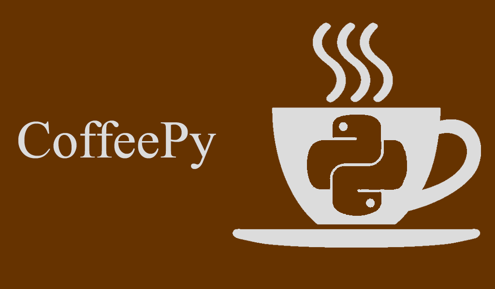
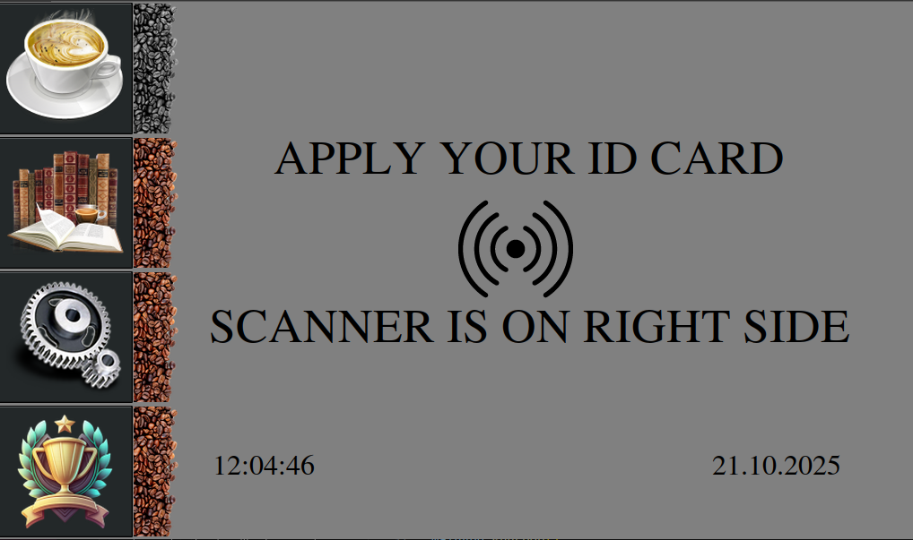
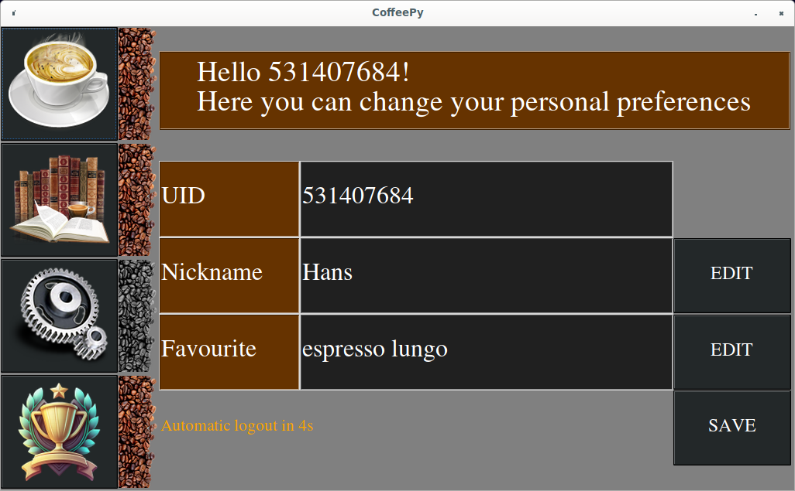
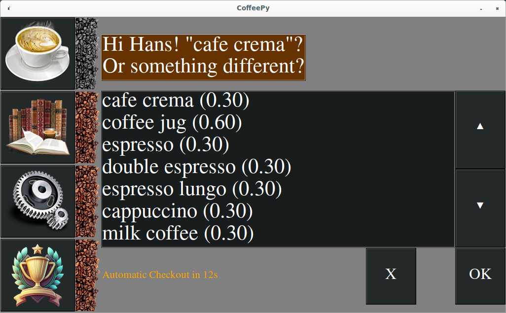
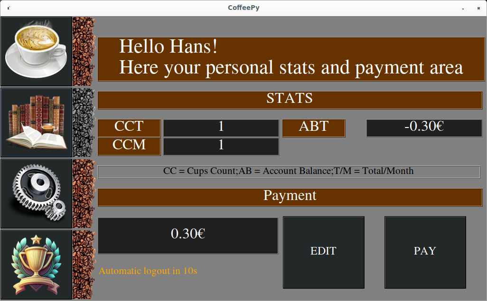
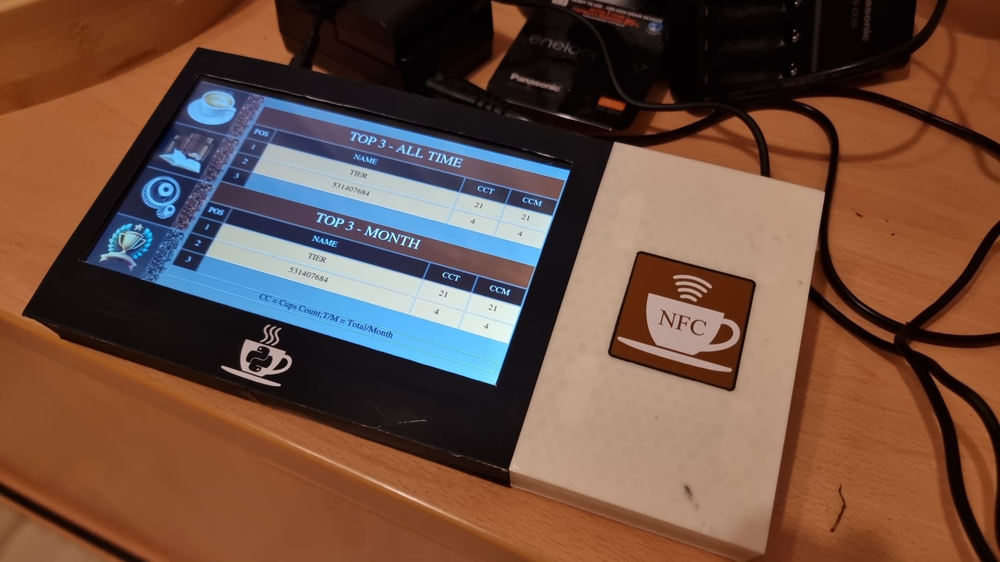

# Abstract

Software to handle coffee matters. Simple GUI with SQL Backend which replaces a pen and paper tally for your coffee machine. To simplify things the identification uses NFC for handling the user management.

The gui is designed for a 1024x600 touchscreen to run it in fullscreen.

# First Steps

## Hardware requirements

- Touchscreen with 1024x600, e.g. https://www.adafruit.com/product/2396
- Advanced Card System ACR122U

## Software requierments

For testing or regular debians you can use [setup_debian.sh](setup_debian.sh) which sets up everything to run CoffeePy, like drivers for the ACR122U.

For raspberry pi got [setup_raspbian.sh](setup_raspbian.sh) added. It will also compile and setup libnfc which is installed already on debian for the ACR122U.

Also awthemes needs to get copied into gui/awthemes-10.4.0. Use the following command in the root folder of CoffeePy:

```
wget http://deb.debian.org/debian/pool/main/t/tcl-awthemes/tcl-awthemes_10.4.0.orig.tar.xz
tar -xf tcl-awthemes_10.4.0.orig.tar.xz -C gui/
rm tcl-awthemes_10.4.0.orig.tar.xz
```

## Initalize

This chapter will show you how to modify and setup CoffeePy, before it can be used.

### Coffee Sorts

Setup coffee sorts is mandatory, otherwise the users cannot select your coffee. For a quick start you can use [GenerateDefaultCoffeeSorts.py](GenerateDefaultCoffeeSorts.py). This can be modified and should only get triggered once. Also you can use sqlite3 to insert your sorts.

```
INSERT INTO coffee_sorts VALUES('<coffee name as string>', <price of coffee as REAL>, <Number of strokes as int>)
```

If you want to modify your sorts later on use the [UPDATE statement](https://www.sqlite.org/lang_update.html) or the [DELETE statement](https://www.sqlite.org/lang_delete.html). Each line has an row id as unique id for your sort, so it can use that as "WHERE" statement in your queries. The price calculation is not directly related to any product, so you can modify it without problems. At least the users may need to change their favs. 


### Backup

You can create a CoffeePy.ini in the root of CoffeePy to setup the backup.

```
[Backup]
Enabled = True
Path = path_to_backup/
Interval = 60
Depth = 48
```

To enable the backup, Enabled must be "True" to disable it has to be set to "False" or its possible to not create the ini File. Path is mandatory if the backup is enabled. The tool will store its backups under this path. 
The parameters Interval and Depth are optional. Interval specifies how often a backup will be generated, in this example it generates every 60 minutes an backup. Depth defines how many backups will be generated. In this case if the program runs for more than two days the last two days are under the backup path (60 min*48 times = 2 days).

The backup files will be named in following scheme "coffee<1..Depth>.db". If the program get restarted the backup always starts at 1.

# Usage

The following picture shows how CoffeePy starts up. On the left side you can find four symbols. The coffee cup symbolizes the order menu which is default function of CoffeePy. The books is for the selection to show you your stats and the possibility to mark your orders as payed.
The gears option is to modify your nickname within the application and your favourite coffee type, so you can faster checkout.
The lowest button is for showing the current ranking and all time stats over all users.

The beans next to the buttons are showing the current selection. If the beans next to the button are black, this submenu is currently selected. All submenues do require a login through the NFC card, except the ranking. Each time a submenu gets changed a login with NFC is required. 



## New User & User Settings
If an new user applies his card to coffeepy he will directed to the setup submenu. By default the UID of the card will be used as nick, but it can be changed to any name. Also it is always possible to change the name by login in the setup menu (gear symbol).
For fast-checkout the favourite coffee sort can be picked. So each time the user will add his card to order, this option will be selected by default. It is always possible to change the coffee product while checkout process.

All date will stored by clicking on the "SAVE" button and the user will be logged out. Next time the user will apply the card the order menu will show up.

If nothing gets saved, the user will be logged out after 20s. Each time an keyboard or selection dialog gets opened the logout timer will get stopped.



## Checkout

If you want to checkout apply the card while the coffee cup is selected. The screen below will show up. By default will your favourite sort be picked, after the checkout counter timed out (20s). You can skip the timer by pressing the ok button.
In case you do not want something press 'x' and your process will be canceled. And if you pick something from the list, the timer will get stopped and you have to press the ok button to proceed. 



## Pay & Personal Stats
The pay & personal stats area is to show you how much coffee you did consume and how your current balance in the kitty is. If the balance is negative, the value will be automatically set in the pay area, so you just have to click on 'pay' after you did put the money in the kitty.
Also its possible to edit the value before paying. 

The stats CCT & CCM are showing your [C]up[C]ount while CCT all time total count shows, is CCM just the current month. ABT is your current balance in the kitty. ABT stands for [A]ccount [B]alance [T]otal.

You will get logged out after 20s, except you are in an subdialog. Each subdialog will reset the logout timer to 20s.



## Ranking
The ranking area does not require a login. It shows the top three of all time and the current month.

# Housing



Folder [housing](housing) contains labels and STL files to create a desk housing for your coffeepy.

# Source note

- All icon from [gui/res](gui/res) were obtained from https://iconarchive.com/
- For tkinter is [awthemes](https://wiki.tcl-lang.org/page/awthemes) gets copied in version 10.4.0 in gui/awthemes-10.4.0, see setup scripts.